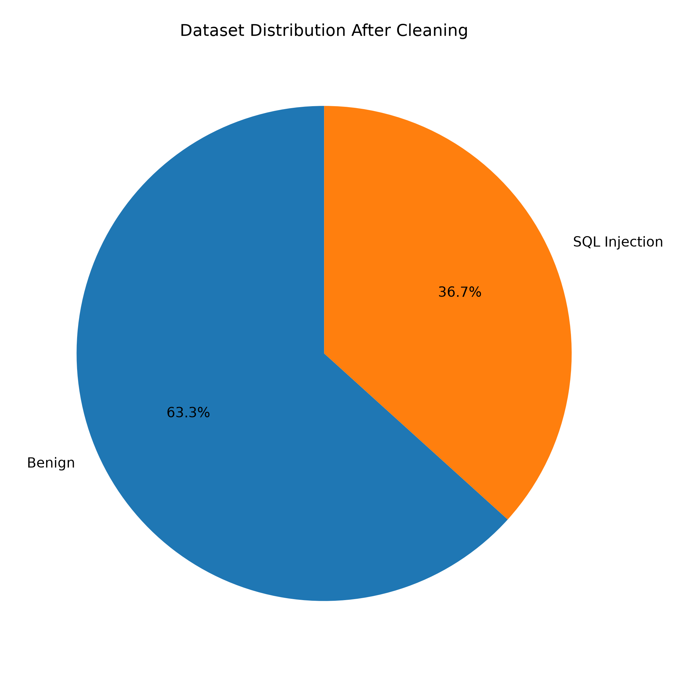
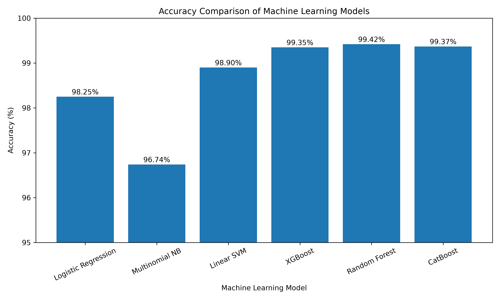
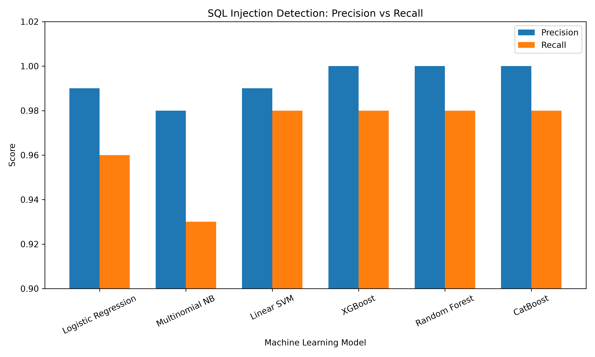
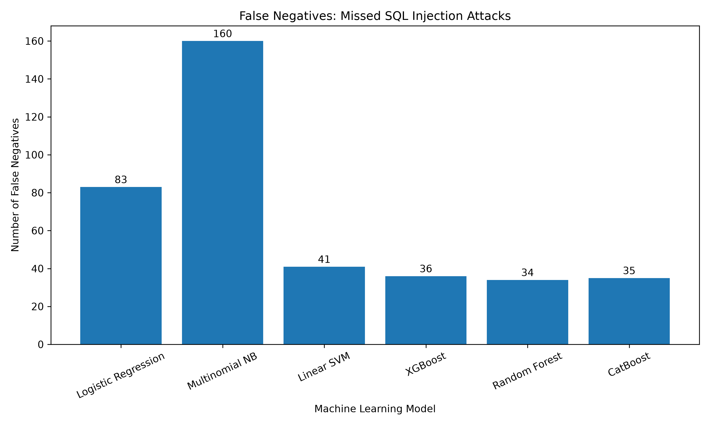

# 🛡️ SQL Injection Detection Using Machine Learning

A cybersecurity and machine learning project that detects whether an SQL query or request-like input is **benign** or contains a possible **SQL Injection attack**.

This project uses **TF-IDF feature extraction** and compares multiple machine learning algorithms to find which model performs best.

---

## 📌 Project Overview

SQL Injection is a common web application attack. It happens when malicious input is included in an SQL query without proper validation or secure handling.

An attacker may try to manipulate a database query by entering specially crafted input. This can sometimes lead to problems such as authentication bypass, unauthorized data access, modification of records, or other database-related attacks.

Traditional detection methods often depend on fixed rules, signatures, or blacklists. These methods can work for known attack patterns. However, attackers may modify or obfuscate their payloads.

This project uses machine learning to study patterns in both normal and malicious SQL inputs.

The model classifies each input into one of two categories:

```text
0 → Benign
1 → SQL Injection
```

---

# 🎯 Objectives

The main objectives of this project are:

- Detect SQL Injection attacks using machine learning.
- Clean and preprocess the dataset.
- Convert SQL queries into numerical features using TF-IDF.
- Compare different machine learning algorithms.
- Evaluate the performance of each model.
- Compare accuracy, precision, recall, and false negatives.
- Identify the best-performing model.

---

# 📂 Project Structure

```text
Project/
│
├── .vscode/
│
├── data/
│   └── dataset.csv
│
├── models/
│   └── catboost_info/
│       ├── learn/
│       ├── tmp/
│       ├── catboost_training.json
│       ├── learn_error.tsv
│       └── time_left.tsv
│
├── results/
│   │
│   ├── accuracy.py
│   ├── distribution_pie.py
│   ├── false_negative.py
│   ├── Precision_Recallgraph.py
│   │
│   ├── accuracy_comparison.png
│   ├── dataset_distribution.png
│   ├── false_negatives_comparison.png
│   └── precision_recall_comparison.png
│
├── src/
│   ├── cat_boost.py
│   ├── logistic_regression.py
│   ├── naive_bayes.py
│   ├── random_forest.py
│   ├── svm.py
│   └── xgboost_model.py
│
└── README.md
```

---

# 📊 Dataset

The dataset used in this project contains SQL queries and request-like inputs labelled as either benign or SQL Injection.

The original dataset contained **30,919 samples**.

After cleaning and removing invalid or empty records, **30,834 samples** were used for training and testing.

## Dataset Statistics

| Category | Number of Samples |
|---|---:|
| Original Dataset | 30,919 |
| Dataset After Cleaning | 30,834 |
| Benign Samples | 19,517 |
| SQL Injection Samples | 11,317 |

The dataset contains two main columns:

| Column | Description |
|---|---|
| `request` | SQL query or request-like input |
| `label` | Classification label |

## Label Meaning

```text
0 → Benign Input
1 → SQL Injection Attack
```

---

# 🥧 Dataset Distribution

After preprocessing, the dataset contained:

- **19,517 Benign samples**
- **11,317 SQL Injection samples**

The graph below shows the distribution of both classes.



---

# 🧹 Data Preprocessing

Before training the machine learning models, the dataset was cleaned and prepared.

The following steps were performed:

1. Loaded the dataset using Pandas.
2. Checked the dataset for missing values.
3. Removed invalid or empty records.
4. Selected the input requests and corresponding labels.
5. Split the dataset into training and testing data.
6. Used a stratified split to maintain a similar class distribution.

---

# 🔀 Train-Test Split

The dataset was divided using an **80:20 train-test split**.

```text
Training Samples: 24,667
Testing Samples:  6,167
```

The split was performed using:

```text
80% → Training Data
20% → Testing Data
```

A `random_state` value of `42` was used so that the experiment could be reproduced.

---

# 🔤 Feature Extraction Using TF-IDF

Machine learning algorithms cannot directly process SQL queries as plain text.

So, **TF-IDF (Term Frequency-Inverse Document Frequency)** was used to convert the SQL inputs into numerical features.

The configuration used was:

```python
ngram_range=(1, 2)
max_features=10000
```

This means that both unigrams and bigrams were used.

### Unigrams

A unigram represents a single word or token.

Example:

```text
SELECT
UNION
DROP
```

### Bigrams

A bigram represents two consecutive words or tokens.

Example:

```text
UNION SELECT
DROP TABLE
ORDER BY
```

Using both unigrams and bigrams helps the models learn individual SQL keywords as well as short patterns.

## Feature Matrix

After TF-IDF transformation:

```text
Training Feature Shape: (24667, 10000)
Testing Feature Shape:  (6167, 10000)
```

---

# 🤖 Machine Learning Models

The following six machine learning algorithms were tested.

| No. | Model |
|---|---|
| 1 | Logistic Regression |
| 2 | Multinomial Naive Bayes |
| 3 | Linear Support Vector Machine |
| 4 | XGBoost |
| 5 | Random Forest |
| 6 | CatBoost |

Each model was trained using the same dataset split and TF-IDF features.

---

# 📈 Accuracy Comparison

The accuracy of each machine learning model is shown below.

| Model | Accuracy |
|---|---:|
| Logistic Regression | 98.25% |
| Multinomial Naive Bayes | 96.74% |
| Linear SVM | 98.90% |
| XGBoost | 99.35% |
| 🏆 Random Forest | **99.42%** |
| CatBoost | 99.37% |

Random Forest achieved the highest accuracy among all the tested models.

## Accuracy Graph



---

# 🎯 Precision and Recall

Accuracy alone does not show the complete performance of a cybersecurity model.

Precision shows how many inputs predicted as SQL Injection were actually malicious.

Recall shows how many actual SQL Injection attacks were successfully detected.

| Model | Precision | Recall |
|---|---:|---:|
| Logistic Regression | 0.99 | 0.96 |
| Multinomial Naive Bayes | 0.98 | 0.93 |
| Linear SVM | 0.99 | 0.98 |
| XGBoost | 1.00 | 0.98 |
| Random Forest | 1.00 | 0.98 |
| CatBoost | 1.00 | 0.98 |

## Precision vs Recall Graph



---

# 🚨 False Negatives

False negatives are important in cybersecurity.

A **False Negative** occurs when an actual SQL Injection attack is incorrectly classified as a benign input.

In simple words:

> The attack was missed by the model.

The false negatives for each model are shown below.

| Model | False Negatives |
|---|---:|
| Logistic Regression | 83 |
| Multinomial Naive Bayes | 160 |
| Linear SVM | 41 |
| XGBoost | 36 |
| 🏆 Random Forest | **34** |
| CatBoost | 35 |

Random Forest had the lowest number of false negatives among the tested models.

## False Negatives Graph



---

# 🔍 Confusion Matrices

## Logistic Regression

```text
[[3879   25]
 [  83 2180]]
```

## Multinomial Naive Bayes

```text
[[3863   41]
 [ 160 2103]]
```

## Linear SVM

```text
[[3877   27]
 [  41 2222]]
```

## XGBoost

```text
[[3900    4]
 [  36 2227]]
```

## 🏆 Random Forest

```text
[[3902    2]
 [  34 2229]]
```

## CatBoost

```text
[[3900    4]
 [  35 2228]]
```

The confusion matrices help show the number of correct and incorrect predictions made by each model.

---

# 📏 Evaluation Metrics

The machine learning models were evaluated using the following metrics:

- Accuracy
- Precision
- Recall
- F1-Score
- Confusion Matrix
- False Negatives

## Accuracy

Accuracy shows the percentage of predictions that were correct.

## Precision

Precision shows how many inputs predicted as SQL Injection were actually malicious.

## Recall

Recall shows how many actual SQL Injection attacks were successfully detected.

## F1-Score

The F1-score combines precision and recall into one value.

## False Negative

A false negative happens when a malicious SQL Injection input is incorrectly classified as benign.

This is important because a missed attack may still reach the web application.

---

# 📁 Source Code

The machine learning models are stored inside the `src` folder.

```text
src/
├── cat_boost.py
├── logistic_regression.py
├── naive_bayes.py
├── random_forest.py
├── svm.py
└── xgboost_model.py
```

Each file is responsible for training and evaluating a specific machine learning model.

---

# 📊 Visualization Scripts

The visualization scripts are stored inside the `results` folder.

```text
results/
├── accuracy.py
├── distribution_pie.py
├── false_negative.py
└── Precision_Recallgraph.py
```

These scripts generate the graphs used to compare the machine learning models.

---

# ⚙️ Installation

## 1. Clone the Repository

```bash
git clone https://github.com/neel-prog/SQL-Injection-Detection-ML.git
```

Move into the project directory:

```bash
cd SQL-Injection-Detection-ML
```

## 2. Create a Virtual Environment

```bash
python -m venv venv
```

Activate the virtual environment on Windows:

```bash
venv\Scripts\activate
```

## 3. Install Required Libraries

```bash
pip install pandas numpy scikit-learn matplotlib xgboost catboost
```

---

# 📦 Libraries Used

The main Python libraries used in this project are:

- Pandas
- NumPy
- Scikit-learn
- Matplotlib
- XGBoost
- CatBoost

You can also create a `requirements.txt` file containing:

```text
pandas
numpy
scikit-learn
matplotlib
xgboost
catboost
```

Then install all dependencies using:

```bash
pip install -r requirements.txt
```

---

# 🚀 Running the Models

Run the individual Python files from the project directory.

## Logistic Regression

```bash
python src/logistic_regression.py
```

## Naive Bayes

```bash
python src/naive_bayes.py
```

## Support Vector Machine

```bash
python src/svm.py
```

## Random Forest

```bash
python src/random_forest.py
```

## XGBoost

```bash
python src/xgboost_model.py
```

## CatBoost

```bash
python src/cat_boost.py
```

---

# 📊 Generating the Graphs

The graph scripts are located inside the `results` folder.

## Accuracy Comparison

```bash
python results/accuracy.py
```

## Dataset Distribution

```bash
python results/distribution_pie.py
```

## False Negatives Comparison

```bash
python results/false_negative.py
```

## Precision vs Recall

```bash
python results/Precision_Recallgraph.py
```

The generated graphs are saved inside the `results` folder.

---

# 🏆 Final Results

Out of the six machine learning algorithms tested, **Random Forest performed the best in this experiment**.

```text
🏆 Best Model: Random Forest
📊 Accuracy: 99.42%
🚨 False Negatives: 34
```

The other ensemble models also performed very well:

```text
XGBoost  → 99.35%
CatBoost → 99.37%
```

Linear SVM and Logistic Regression also achieved strong results, while Multinomial Naive Bayes had the lowest accuracy among the tested models.

---

# ⚠️ Limitations

This project has some limitations.

- The models were mainly tested using one dataset.
- Performance may change when tested with completely new SQL Injection payloads.
- Real-world attackers may use obfuscation techniques that are not present in the training dataset.
- High accuracy on a dataset does not guarantee the same performance in every real-world situation.

Because of this, machine learning should be treated as an additional detection layer.

It should not replace secure coding practices such as:

- Parameterized queries
- Prepared statements
- Input validation
- Proper error handling
- Least privilege database access

---

# 🔮 Future Improvements

This project can be improved in several ways:

- Test the models using multiple datasets.
- Test using real-world HTTP request data.
- Use character-level features.
- Test word embeddings.
- Compare deep learning models.
- Test transformer-based models.
- Build a real-time SQL Injection detection API.
- Integrate the model with a web application.
- Explore integration with a Web Application Firewall.

---

# 📚 Dataset Source

The dataset used for this project was obtained from Kaggle.

**SQL Injection Dataset:**

:contentReference[oaicite:0]{index=0}

---

# 👨‍💻 Author

**Neel Kiran Sankpal**

B.Tech in Computer Science and Engineering  
Specialization: Cybersecurity

---

# ⭐ Conclusion

This project compares six machine learning algorithms for SQL Injection detection using TF-IDF features.

The models were trained and tested using the same dataset split so that their performance could be compared under similar conditions.

Among all the tested models, **Random Forest achieved the best result with 99.42% accuracy**. It also had the **lowest number of false negatives**, meaning it missed fewer SQL Injection samples than the other models in this experiment.

This project shows that machine learning can be useful as an additional layer for detecting suspicious SQL inputs. However, it should work alongside proper secure coding practices rather than replacing them.

---

⭐ If you found this project useful, consider giving the repository a star!